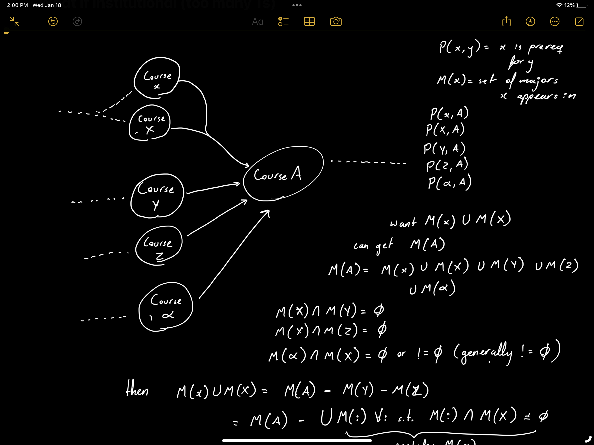

IT'S BECAUSE OTHER CLASSES HAVE BE27 EVEN THOUGH THEY DEPEND ON MATH 20C/31BH. EXAMPLE: BENG 100. SO WHEN IT GOES IN IT GETS BOTH! 
CONSIDER CHANGING ALL THE METHODS TO WORK THIS WAY THIS IS ACTUALLY KINDA GOOD
Looking back on it these notes suck. Note to self to take better notes, I have to retest this now.

## Better notes:
This is a very interesting sample conundrum (not really but I like the word)
    Adding a course right before MATH 20C should affect everything that 20C is in, and everything that depends on it.
    Removing MATH 20C should affect the same number of plans (408)
    However, just looking at the MATH 20C major labels (what the true strict flag does) returns 376 affected plans
    Looking at the dependencies path for MATH 20C indeed returns the same number of affected plans as adding MATH 20B.5
    Let's dig deeper:
    BE27: The course is listed as "MATH 20C or 30BH". However, at least one course with a standard name (ex. BENG 100)
    has MATH 20C as a prereq and MATH 20C or 30BH as a prereq so looking through MATH 20C's centrality paths in the condensed document
    will include BENG 100. Since we union the major labels at each step, we include the labels where BENG 100 didn't really come from MATH 20C but 
    "MATH 20C or 30BH"

    BE27: FI, MU, RE, SI, SN, TH, WA, curriculum,
    BE29: FI, MU, RE, SI, SN, TH, WA, curriculum,
    CH35: FI, MU, RE, SI, SN, TH, WA, curriculum,
    CH38: FI, MU, RE, SI, SN, TH, WA, curriculum,
    These are the 32 plans that make up the difference. 

    BE29: Same MATH 20C or MATH 30BH stuff
    CH35: This is interesting. The curriculum has MATH 10C. Intuitively MATH 10C is unaffected by changes to MATH 20c
    maybe we should call the strict/not strict-option an upper and lower count
    what's interesting is the Revelle plan says MATH 10C or 20C. We could make a case for all 10 series being affected by 20 series changes, but I'm not sure how to proceed.
    CH38: Same as CH35

What to do?
This is also an interesting conundrum because it implies the adding algorithm is also over-counting >:(
That being said, there are 160*8 roughly 800 plans
An error of 16 plans is 2%

So! This problem seems a little impossible without better information or better encoding. The problem is abstractedly detailed below.

Motivation and problem set-up: Capture the "correct" set of labels that are affected by a change to the course prerequisites structure.
Normally, one would just take a look at the labels in an existing course's canonical name. 
However, in order to add a course, we take a look at all the dependencies and count the union of the major labels that appear there. 
The two methods don't always produce the same count.
For example, adding a prerequisite to MATH 20C should affect all the same plans that deleting MATH 20C would affect. The dependency method captures more courses and therefore more plans.

This is good in terms of the $X$ and $x$ nodes in the above picture, i.e. in cases where the courses are roughly the same. Say $X$ is MATH 20C and $x$ is MATH 20C or 31BH. If we delete MATH 20C, the MATH 20C or 31BH should be affected (arguably, but there's closer examples like MATH 20CC that serve the same purpose).

However, we don't want to capture $Y$ or $Z$ because they aren't the "same" course as $X$ (they are equivalent in terms of prerequisites but they aren't the same). Say, $Y$ is MATH 10C - there are some majors that have course $A$ and course $Y$ and some have course $A$ and course $X$. However, changes to $X$ shouldn't affect the majors that have explicitly chosen to use $Y$ as their prerequisite to course $A$. Course $Z$ is for abstract fluff. 

The third type of course here is course $\alpha$. That is going to be an AND requisite of course $A$, so it's appearance isn't related to courses $X$, $Y$, or $Z$. There acan be several $\alpha$-type courses. 

Terminology: $M(i)$ is the set of majors/plans that course $i$ appears in.

